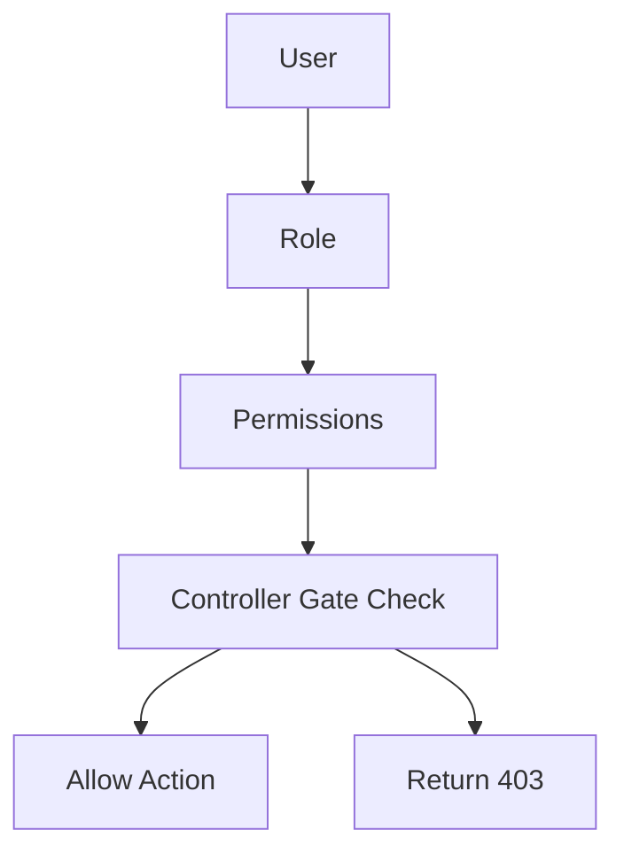
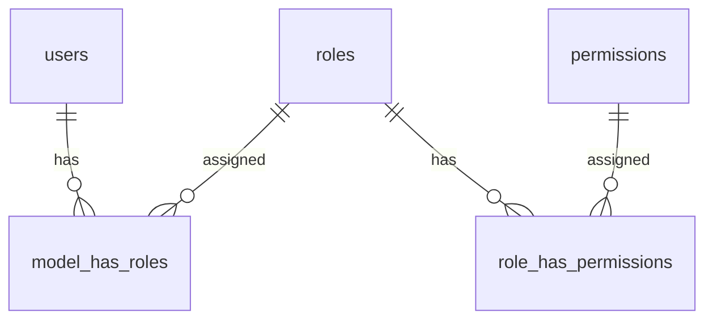
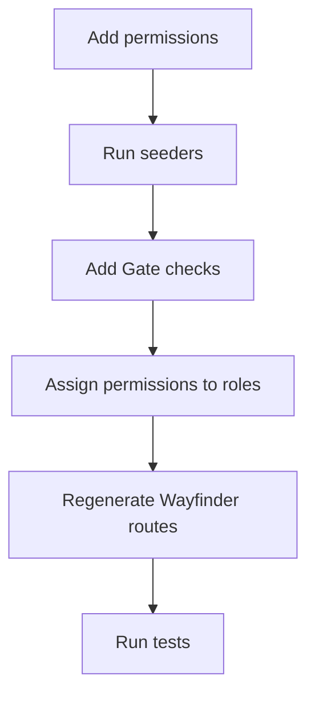

# Roles And Permissions Guide

This project uses `spatie/laravel-permission` for role-based access control.

Simple rule:

```text
User -> Role -> Permissions
```

Controllers protect role management actions with `Gate::authorize('permission name')`.

## Main Files

```text
app/Models/User.php
app/Http/Controllers/Admin/RolesAndPermissions/RoleController.php
app/Http/Requests/RolesAndPermissions/StoreRoleRequest.php
app/Http/Requests/RolesAndPermissions/UpdateRoleRequest.php
app/Actions/Roles/CreateRole.php
app/Actions/Roles/UpdateRole.php
app/Actions/Roles/DeleteRole.php
app/Notifications/RoleCreatedNotification.php
database/seeders/permissions/PermissionSeeder.php
database/seeders/permissions/RoleSeeder.php
resources/js/pages/RolesAndPermissions/Index.vue
resources/js/components/AppSidebar.vue
routes/web.php
```

## Structure





## Default Roles

These roles are created by `Database\Seeders\permissions\RoleSeeder`.

```text
Superadmin
Teacher
Student
```

`Superadmin` receives every permission from `Permission::all()`.

`Database\Seeders\DatabaseSeeder` creates the default admin user and assigns the `Superadmin` role.

```text
name: Super Admin
email: admin@gmail.com
role: Superadmin
```

The Roles & Permissions page manages custom roles only. It excludes `Superadmin`, `Teacher`, and `Student` from the role listing.

## Current Permissions

These permissions are seeded by `Database\Seeders\permissions\PermissionSeeder`.

```text
admin view roles
admin create roles
admin update roles
admin delete roles
```

## Permission Naming

Role management permissions currently use this format:

```text
admin action feature
```

Current examples:

```text
admin view roles
admin create roles
admin update roles
admin delete roles
```

Use the same style for new administration-only permissions.

## Routes

Current role routes are defined in `routes/web.php` inside the `auth` and `verified` middleware group.

```php
use App\Http\Controllers\Admin\RolesAndPermissions\RoleController;

Route::middleware(['auth', 'verified'])->group(function () {
    Route::prefix('administration')->name('administration.')->group(function () {
        Route::prefix('roles')->name('roles.')->group(function () {
            Route::get('/', [RoleController::class, 'index'])->name('index');
            Route::post('/', [RoleController::class, 'store'])->name('store');
            Route::put('/{role}', [RoleController::class, 'update'])->name('update');
            Route::delete('/{role}', [RoleController::class, 'destroy'])->name('destroy');
        });
    });
});
```

Named routes:

```text
administration.roles.index
administration.roles.store
administration.roles.update
administration.roles.destroy
```

## Controller Access

Each route has a matching permission check inside `App\Http\Controllers\Admin\RolesAndPermissions\RoleController`.

```text
index   -> admin view roles
store   -> admin create roles
update  -> admin update roles
destroy -> admin delete roles
```

The controller renders `RolesAndPermissions/Index` through Inertia.

## Role Listing

The index action returns:

```text
roles
guards
permissions
filters
```

Role listing behavior:

```text
- selects id, name, and guard_name
- loads admin permissions assigned to each role
- filters by search text across role name and guard name
- filters by guard when guard is not "all"
- excludes Superadmin, Teacher, and Student
- orders by role name
- paginates 10 roles per page
```

The `permissions` prop only includes permissions whose names contain `admin`. The display name removes the `admin` prefix, so `admin view roles` is shown as `view roles`.

## Creating Roles

`CreateRole` creates all new roles with the `web` guard.

```text
name: submitted role name
guard_name: web
permissions: submitted permission ids
```

After a role is created, all users with the `Superadmin` role receive `RoleCreatedNotification`.

Create validation is handled by `StoreRoleRequest`.

```text
name            required, string, max 255, unique in roles.name
permissions     nullable array
permissions.*   integer, existing web permission id
```

## Updating Roles

`UpdateRole` updates the role name and replaces the assigned permissions with the submitted permission ids.

Update validation is handled by `UpdateRoleRequest`.

```text
name            required, string, max 255, unique for the role guard
permissions     nullable array
permissions.*   integer, existing permission id for the role guard
```

## Deleting Roles

`DeleteRole` deletes the role inside a database transaction.

## Frontend

The roles page is here:

```text
resources/js/pages/RolesAndPermissions/Index.vue
```

The page uses Wayfinder route helpers from:

```ts
import { destroy, index, store, update } from '@/routes/administration/roles';
```

Frontend behavior:

```text
- search roles with a 300ms debounce
- filter roles by guard
- create roles in a sheet
- edit roles in a sheet
- delete roles through a confirmation dialog
- search permissions inside create and edit sheets
- group permissions by category
- preserve scroll during form submissions and filter visits
```

The sidebar entry is in:

```text
resources/js/components/AppSidebar.vue
```

Regenerate Wayfinder routes after changing backend routes.

```bash
php artisan wayfinder:generate
```

## Add Permissions For A New Feature

### 1. Add permissions to the seeder

Open:

```text
database/seeders/permissions/PermissionSeeder.php
```

Add the new permissions.

```php
$permissions = [
    'admin view roles',
    'admin create roles',
    'admin update roles',
    'admin delete roles',

    'admin view courses',
    'admin create courses',
    'admin update courses',
    'admin delete courses',
];
```

### 2. Run the seeders

```bash
php artisan db:seed --class="Database\\Seeders\\permissions\\PermissionSeeder"
php artisan db:seed --class="Database\\Seeders\\permissions\\RoleSeeder"
php artisan permission:cache-reset
```

### 3. Protect the controller

Use `Gate::authorize()` before the action runs.

```php
use Illuminate\Support\Facades\Gate;

public function index(): Response
{
    Gate::authorize('admin view courses');

    return Inertia::render('Courses/Index');
}
```

Use one permission per action.

```php
Gate::authorize('admin view courses');
Gate::authorize('admin create courses');
Gate::authorize('admin update courses');
Gate::authorize('admin delete courses');
```

### 4. Assign permissions to a role

Use the UI:

```text
Administration > Roles & Permissions > Edit role > Select permissions > Save
```

Use code in seeders or tests:

```php
use Spatie\Permission\Models\Role;

$role = Role::findByName('Teacher', 'web');

$role->givePermissionTo([
    'admin view courses',
    'admin create courses',
    'admin update courses',
]);
```

## Test The Changes

Run the related tests.

```bash
php artisan test --compact tests/Feature/RoleControllerTest.php
php artisan test --compact tests/Feature/RoleControllerAuthorizationTest.php
php artisan test --compact tests/Feature/RoleIndexTest.php
php artisan test --compact tests/Feature/RoleStoreTest.php
php artisan test --compact tests/Feature/RolePermissionAssignmentTest.php
```

Run all tests before merging.

```bash
php artisan test --compact
```

## New Feature Checklist


